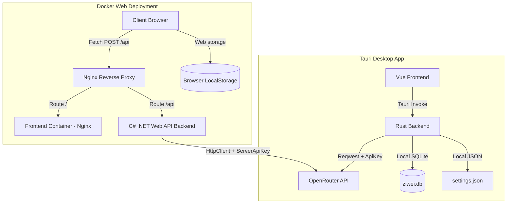

# Architecture & Implementation Specification: ZiWei Analyzer

## 1. Project Overview
ZiWei Analyzer is a hybrid Chinese astrology application that calculates traditional **Zi Wei Dou Shu (Purple Star Astrology / 紫微斗数)** charts, manages user profiles, visualizes the astrological chart in a responsive format, and provides an interactive AI interpretation oracle powered by OpenRouter.

The application is designed to support two distinct operational modes:
1. **Desktop/Mobile Mode (Tauri v2)**: A standalone client application for PC (Windows/macOS) and Mobile (Android).
2. **Web Mode (Docker)**: A server-deployed web application powered by a C# .NET 10.0 Web API backend and reverse-proxied by Nginx.

---

## 2. Tech Stack & Scaffolding Guidelines

* **Frontend**: Vue 3 (Composition API, TypeScript) + Tailwind CSS + Lucide Icons.
* **Astrology Calculation Engine**: `iztro` (TypeScript library executed on the client frontend).
* **Desktop Backend (Tauri)**: Rust (Tauri v2 Core) providing local file-system and SQLite integration.
* **Web Backend**: C# .NET 10.0 Web API acts as a secure, server-side OpenRouter proxy and SSE streaming host.
* **Database**:
  * **Tauri Mode**: SQLite via the `rusqlite` Rust crate.
  * **Web Mode**: Browser `localStorage` for profile and settings storage.
* **Reverse Proxy / Deployment**: Nginx + Docker Compose for multi-container orchestration.
* **State Management**: Custom lightweight reactive Vue store ([useStore.ts](file:///d:/workspace/my/ziwei/ziwei/src/store/useStore.ts)).

---

## 3. Hybrid Architecture & Security Design

The application ensures that OpenRouter API requests are processed securely according to the active deployment environment.



### 3.1 Desktop Mode (Tauri)
* **API Key Management**: 
  * Users enter their OpenRouter API Key in the settings interface, which is passed to the Rust backend via Tauri `invoke`.
  * Rust securely stores the key locally in `settings.json` within the app's configuration directory.
* **AI Network Requests**:
  * The frontend initiates requests via the `ask_ai` Tauri command.
  * The Rust backend builds the request using `reqwest`, injects the API key, issues the API call to OpenRouter with `stream: true`, and broadcasts response chunks back to Vue using Tauri Events (`ai-response-chunk`).

### 3.2 Web Mode (Docker Deployment)
* **API Key Management**: 
  * The OpenRouter API Key is stored on the server side as an environment variable (`OpenRouter__ApiKey`) or in the C# `appsettings.json` configuration.
  * The client browser has no access to and does not hold the API key, preventing key exposure.
* **AI Network Requests**:
  * The frontend sends an HTTP POST request containing the pruned chart context and user prompt to `/api/astrology/analyze`.
  * The C# .NET backend reads the request, attaches the server-side configured API key, and calls the OpenRouter API.
  * The response is streamed back to the client browser in real time using Server-Sent Events (SSE) via the `text/event-stream` protocol.

---

## 4. State & Profile Management (The Archive)

Profiles and configuration settings are saved differently depending on the platform context:

### 4.1 SQLite Database (Tauri Mode)
* **Storage Path**: Tauri's `BaseDirectory::AppLocalData` path.
* **Schema**:
  * `profiles`: `id` (TEXT PRIMARY KEY), `name` (TEXT), `gender` (TEXT), `birth_type` (TEXT - solar/lunar), `is_leap_month` (INTEGER), `birth_date` (TEXT - YYYY-MM-DD HH), `created_at` (TEXT).
* **Implementation**: Managed by [lib.rs](file:///d:/workspace/my/ziwei/ziwei/src-tauri/src/lib.rs) utilizing `rusqlite`.

### 4.2 Browser Storage (Web Mode)
* **Profiles Storage**: Saved under the `ziwei_profiles` key in browser `localStorage`.
* **Settings Storage**: Saved under the `ziwei_settings` key in browser `localStorage` (AI model is locked to the server's default, e.g., `deepseek/deepseek-v4-flash`).

---

## 5. UI/UX & Responsive Visualization Strategy

The user interface adapts dynamically to the viewport size.

### 5.1 Input & Archive Module
* **Profile Form**: Standard form asking for Name, Gender, Birth Date/Time, Calendar Type (Solar/Lunar), and Leap Month toggle.
* **Archive List**: Drawer interface showing stored profiles. Selecting a profile queries it and parses it into `iztro`.

### 5.2 Astrolabe Visualization
* **PC Grid (Desktop Viewport)**:
  * Traditional **12-Palace Grid (十二宫格)**.
  * Renders a 4x4 CSS grid. The outer 12 cells represent the Earthly Branches, while the central 2x2 cells display the profile's basic details, BaZi (八字), and Five Elements Phase (五行局).
* **Mobile View (Mobile/Android Viewport)**:
  * The central profile info forms a sticky top header.
  * The 12 palaces are rendered as a vertical list of cards that can be expanded to view minor details.

### 5.3 Interactive Features
* **San Fang Si Zheng (三方四正)**: Hovering or tapping a palace highlights its opposite and trine palaces while dimming the other cells to emphasize the astrological relationships.
* **Decadal & Annual Horoscopes**: Users can click or tap palaces to toggle active Decades (大限) and Ages (流年), which overlay flying stars and decadal elements onto the chart.

---

## 6. AI Interaction Engine (The AI Oracle)

The AI interaction is coordinated by [aiService.ts](file:///d:/workspace/my/ziwei/ziwei/src/services/aiService.ts) and [useStore.ts](file:///d:/workspace/my/ziwei/ziwei/src/store/useStore.ts).

### 6.1 Data Pruning
Before sending data to the LLM, the raw JSON is pruned via `extractChartSummary` to reduce prompt token size and eliminate hallucination risks. It extracts:
* Basic info: Yin/Yang, Gender, Five Elements Phase.
* Configurations of the 12 palaces (major/minor stars, transformations, decadal age ranges, longevity state, active decadal/annual flying stars).
* Selected Decade and Year.

### 6.2 Deep Palace Analysis
When a user requests a deep analysis of a specific palace, the AI operates under a strict system prompt workflow:
1. **Determine the Tone**: Evaluate major stars and their brightness (廟旺利陷).
2. **Observe Transformations (四化)**: Prioritize analyzing Hua Lu, Hua Quan, Hua Ke, and Hua Ji.
3. **Check Auxiliary Stars**: Analyze the influence of lucky and unlucky stars.
4. **Output Format**:
   * **Core Traits (核心特质)**: One-sentence summary.
   * **Deep Analysis (深度解析)**: Logical, non-templated explanation.
   * **Potential Risks (潜在风险)**: Hazards or psychological blind spots.
   * **Master's Advice (宗师建议)**: Actionable modern life guidance.

---

## 7. Web Service & Docker Deployment Architecture

The Web deployment environment packages the frontend and C# backend as separate containers proxied by an external Nginx server.

```
[Client Browser]
       │
       ▼ (Port 8080)
┌──────────────────────────────────────┐
│            nginx-proxy               │
│                                      │
│  /     --> http://frontend:80;       │
│  /api/ --> http://backend:5074;      │
└──────────────────────────────────────┘
       │                        │
       ├────────────────────────┘
       ▼                        ▼
┌──────────────┐         ┌──────────────┐
│   frontend   │         │   backend    │
│ (Vite + Vue) │         │ (.NET Core)  │
│  Port 80     │         │  Port 5074   │
└──────────────┘         └──────────────┘
```

### 7.1 Docker Services ([docker-compose.yml](file:///d:/workspace/my/ziwei/docker-compose.yml))
1. **backend**:
   * Builds from [backend/Dockerfile](file:///d:/workspace/my/ziwei/backend/Dockerfile) utilizing the `.NET 10.0` SDK and Runtime.
   * Configures ASP.NET Core environment variables.
   * Receives OpenRouter keys and default model selections via environment variables (`OpenRouter__ApiKey`, `OpenRouter__DefaultModel`).
2. **frontend**:
   * Builds from [ziwei/Dockerfile](file:///d:/workspace/my/ziwei/ziwei/Dockerfile) using `Node.js` and `pnpm`.
   * Serves static compiled files through Nginx.
3. **proxy**:
   * Runs Nginx on port 8080.
   * Forwards frontend assets and reverse-proxies `/api/` calls to the backend.

---

## 8. Documentation Maintenance
Ensure both this spec file and the root [README.md](file:///d:/workspace/my/ziwei/README.md) are updated synchronously when making architectural changes.